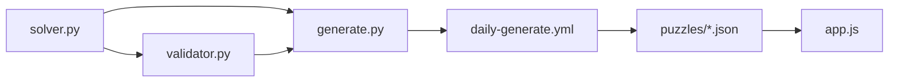

# Implementation Plan: Yen-Doku Daily Sudoku System

**Branch**: `core-sudoku-system` | **Date**: 2026-01-11 | **Spec**: [spec.md](spec.md)  
**Input**: Feature specification from `.specify/specs/core/spec.md`

---

## Summary

Build a daily Sudoku puzzle system that:
1. **Generates** one valid puzzle per day via GitHub Actions (Python)
2. **Validates** every puzzle has exactly one solution before commit
3. **Serves** puzzles as static JSON via GitHub Pages
4. **Renders** an interactive web UI for solving (JavaScript)

**Technical Approach**: Use `py-sudoku` library for generation/solving, add custom uniqueness validation, pure vanilla JS frontend with no frameworks.

---

## Technical Context

| Aspect | Decision |
|--------|----------|
| **Language/Version** | Python 3.11+ (CI), JavaScript ES6+ (browser) |
| **Primary Dependencies** | `py-sudoku` (generation), `pytest` (testing) |
| **Storage** | JSON files in `puzzles/<year>/<difficulty>/YYYY-MM-DD.json` |
| **Testing** | `pytest` for Python, manual + browser console for JS |
| **Target Platform** | GitHub Actions (Ubuntu), GitHub Pages (static hosting) |
| **Project Type** | Static site with CI-generated content |
| **Performance Goals** | Generation <30s per difficulty, page load <2s on 3G |
| **Constraints** | GitHub free-tier only, no external APIs |
| **Scale/Scope** | 4 puzzles/day (one per difficulty), indefinite operation |

---

## Constitution Check ✅

| Principle | Compliance |
|-----------|------------|
| I. Correctness First | ✅ Validator blocks commits if uniqueness fails |
| II. Technology Separation | ✅ Python in CI only, JS in browser only |
| III. Static-First | ✅ GitHub Pages, JSON files, no databases |
| IV. Test-Driven | ✅ pytest for solver/validator before implementation |
| V. Simplicity | ✅ Vanilla JS, no frameworks, single-file scripts |

**No violations. Proceed with implementation.**

---

## Project Structure

### Documentation

```
.specify/specs/core/
├── spec.md              # Requirements & user stories ✅
├── research.md          # Library research ✅
├── checklist.md         # Feature tracking ✅
├── plan.md              # This file ✅
└── tasks.md             # Task breakdown (Phase 2)
```

### Source Code (Repository Root)

```
yen-doku/
├── .github/
│   └── workflows/
│       └── daily-generate.yml    # CI workflow
│
├── scripts/
│   ├── __init__.py
│   ├── generate.py               # Puzzle generation
│   ├── solver.py                 # Solution finder
│   ├── validator.py              # Rule enforcement
│   └── difficulty.py             # Difficulty scoring
│
├── tests/
│   ├── __init__.py
│   ├── test_solver.py
│   ├── test_validator.py
│   ├── test_generator.py
│   └── test_difficulty.py
│
├── docs/                         # GitHub Pages (production)
│   ├── index.html
│   ├── app.js
│   ├── style.css
│   ├── sw.js
│   └── puzzles/
│       └── 2026/
│           ├── index.json
│           ├── easy/
│           │   └── 2026-01-11.json
│           ├── medium/
│           │   └── 2026-01-11.json
│           ├── hard/
│           │   └── 2026-01-11.json
│           └── extreme/
│               └── 2026-01-11.json
│
├── requirements.txt
├── .gitignore
└── README.md
```

**Structure Decision**: Flat scripts folder (not a package) for simplicity. Each script is independently runnable via CLI.

---

## Implementation Phases

### Phase 0: Foundation (Day 1)
**Goal**: Project scaffold, dependencies, basic tests

| Task | Description | Deliverable |
|------|-------------|-------------|
| 0.1 | Create folder structure | All directories exist |
| 0.2 | Initialize `requirements.txt` | `py-sudoku`, `pytest` |
| 0.3 | Create `.gitignore` | Python, IDE, OS ignores |
| 0.4 | Stub `solver.py` with failing test | TDD setup |
| 0.5 | Stub `validator.py` with failing test | TDD setup |

**Exit Criteria**: `pytest` runs and reports 2 failing tests.

---

### Phase 1: Core Engine (Days 2-3)
**Goal**: Solver and validator working with tests passing

| Task | Description | Deliverable |
|------|-------------|-------------|
| 1.1 | Implement `solver.py` | Solve any valid puzzle |
| 1.2 | Add uniqueness check | `count_solutions(grid, max=2)` |
| 1.3 | Write solver tests | 5+ test cases (valid, invalid, multiple solutions) |
| 1.4 | Implement `validator.py` | Check rows, cols, boxes |
| 1.5 | Write validator tests | Edge cases covered |
| 1.6 | Implement `difficulty.py` | Clue count → rating |

**Exit Criteria**: All tests pass. `python scripts/solver.py puzzle.json` works.

---

### Phase 2: Generator (Day 4)
**Goal**: Generate valid puzzles deterministically for all 4 difficulty levels

| Task | Description | Deliverable |
|------|-------------|-------------|
| 2.1 | Implement `generate.py` | Uses py-sudoku with date seed |
| 2.2 | Integrate uniqueness validation | Retry if multiple solutions |
| 2.3 | Output JSON in correct schema | Matches contract (includes clueCount) |
| 2.4 | Write generator tests | Determinism, schema validation |
| 2.5 | Add CLI interface | `python scripts/generate.py 2026-01-11 --difficulty extreme` |
| 2.6 | Support all 4 difficulties | easy, medium, hard, extreme via flag |

**Exit Criteria**: Running `generate.py 2026-01-11` twice produces identical JSON.

---

### Phase 3: CI Pipeline (Day 5)
**Goal**: Automated daily generation of 4 puzzles

| Task | Description | Deliverable |
|------|-------------|-------------|
| 3.1 | Create `daily-generate.yml` | Cron schedule (daily UTC) |
| 3.2 | Install dependencies in CI | `pip install -r requirements.txt` |
| 3.3 | Run generator for all difficulties | Loop: easy, medium, hard, extreme |
| 3.4 | Run validator on all 4 puzzles | Fail workflow if any invalid |
| 3.5 | Commit and push | Only if all validations pass |
| 3.6 | Add idempotency check | Skip difficulty if file exists |

**Exit Criteria**: Manual workflow trigger creates and commits 4 puzzles (one per difficulty).

---

### Phase 4: Static Site - Basic (Days 6-7)
**Goal**: Render today's puzzle with difficulty navigation and modern design

| Task | Description | Deliverable |
|------|-------------|-------------|
| 4.1 | Create `index.html` | 9×9 grid structure |
| 4.2 | Create `style.css` | Modern grid styling, 3×3 borders |
| 4.3 | Create `app.js` | Fetch and render puzzle |
| 4.4 | Handle missing puzzle | Error message display |
| 4.5 | Configure GitHub Pages | Serve from `/site` |
| 4.6 | Difficulty selector | 4 buttons: easy/medium/hard/extreme |
| 4.7 | Default to extreme | Load extreme puzzle on initial visit |
| 4.8 | URL state | `?difficulty=hard` query param |
| 4.9 | Clue cell styling | Bold font, dark color (#1a1a2e) |
| 4.10 | User cell styling | Regular weight, distinct color (#3a86ff) |
| 4.11 | Selected cell highlight | Clear visual focus indicator |
| 4.12 | Related cells highlight | Same row/col/box subtle background |
| 4.13 | Mobile responsive | Touch-friendly, min 44px targets |

**Exit Criteria**: Visiting GitHub Pages URL shows today's extreme puzzle with difficulty switcher.

---

### Phase 5: Interactive Solving (Days 7-8)
**Goal**: Full solving experience

| Task | Description | Deliverable |
|------|-------------|-------------|
| 5.1 | Cell input handling | Keyboard 1-9, ignore invalid |
| 5.2 | Conflict detection | Highlight row/col/box duplicates |
| 5.3 | Completion detection | Success message when done |
| 5.4 | "Check" button | Validate against solution |
| 5.5 | Visual feedback | Green/red for correct/incorrect |
| 5.6 | "Reset" button | Restore initial state |

**Exit Criteria**: User can solve puzzle end-to-end with feedback.

---

### Phase 6: Notes Mode (Day 9)
**Goal**: Pencil marks for advanced solving

| Task | Description | Deliverable |
|------|-------------|-------------|
| 6.1 | Notes mode toggle | UI button, visual indicator |
| 6.2 | Multi-digit entry | Small numbers in cell corners |
| 6.3 | Toggle behavior | Press again to remove |
| 6.4 | Clear on value entry | Notes disappear when final value set |

**Exit Criteria**: User can enter and manage pencil marks.

---

### Phase 7: Polish (Day 11)
**Goal**: Final features and cleanup

| Task | Description | Deliverable |
|------|-------------|-------------|
| 7.1 | "Reveal Solution" button | Fill grid from solution |
| 7.2 | Difficulty badge | Show current level (easy/medium/hard/extreme) |
| 7.3 | Active button state | Highlight current difficulty button |
| 7.4 | README documentation | Setup, usage, contributing |
| 7.5 | Final testing | End-to-end manual test on all 4 difficulties |

**Exit Criteria**: Production-ready for public use.

---

## Milestones Summary

| Milestone | Phases | Duration | Key Deliverable |
|-----------|--------|----------|-----------------|
| **M1: Engine** | 0-1 | 3 days | Solver + Validator with tests |
| **M2: Generation** | 2-3 | 2 days | 4-difficulty puzzle creation via CI |
| **M3: UI + Navigation** | 4 | 2 days | Puzzle renders with difficulty selector |
| **M4: Interactive** | 5-6 | 3 days | Full solving experience |
| **M5: Complete** | 7 | 1 day | Production ready |

**Total Estimated Duration**: 11 days

---

## Risk Mitigation

| Risk | Likelihood | Impact | Mitigation |
|------|------------|--------|------------|
| py-sudoku generates multi-solution puzzles | Medium | High | Custom uniqueness check, retry logic |
| GitHub Actions rate limits | Low | Medium | Efficient workflow, single daily run |
| Puzzle generation too slow | Low | Medium | Profile, optimize, or cache |
| Browser compatibility issues | Medium | Low | Test on Chrome/Firefox/Safari |

---

## Dependencies



**Critical Path**: `solver.py` → `generate.py` → CI → site

---

## Next Steps

1. **Run `/tasks`** to generate detailed task breakdown for Phase 0-1
2. Begin TDD: Write failing tests for solver
3. Implement solver, get tests green
4. Repeat for validator, generator, CI, site

---

## Change Log

| Date | Change |
|------|--------|
| 2026-01-11 | Initial plan created from spec.md |
