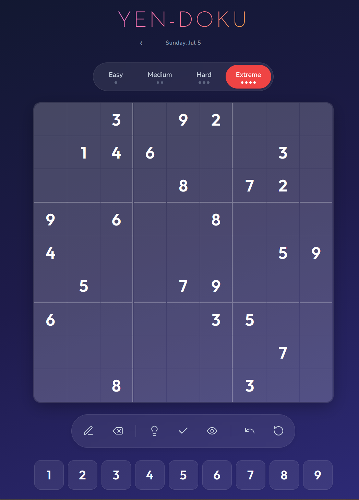
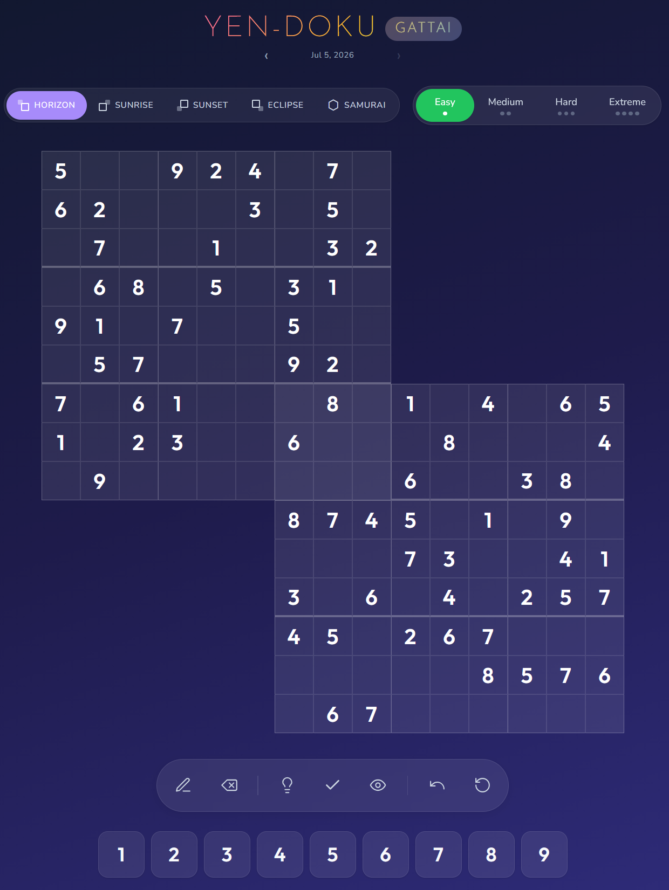

# Yen-Doku

**Yen-Doku** is a daily Sudoku game that runs entirely in your browser — no installs, no accounts, no ads. A fresh set of puzzles is generated every day at midnight UTC across four difficulty levels, plus five overlapping **Gattai** (Samurai) variants for when one 9×9 grid isn't enough. Play with mouse, touch, or full keyboard navigation, race the built-in timer, chase your best times, and keep solving even when you're offline.

[](https://github.com/miztiik/yen-doku/actions/workflows/daily-generate.yml) 
## Play

**[miztiik.github.io/yen-doku](https://miztiik.github.io/yen-doku/)**

## Screenshots

| Classic — one 9×9 grid | Gattai — overlapping grids |
| :--------------------: | :------------------------: |
|  |  |

## How to Play

### 1. Pick a board and difficulty

Yen-Doku has two boards:

- **Classic** — the traditional single 9×9 grid. Fill every row, column, and 3×3 box with the digits 1–9, using each number exactly once.
- **[Gattai](https://miztiik.github.io/yen-doku/gattai.html)** — two-to-five 9×9 grids that share 3×3 corner boxes, so a number placed in an overlap must satisfy *both* grids at once. Choose from five layouts:

  | Mode | Grids | Shape |
  | ---- | :---: | ----- |
  | **Horizon** | 2 | top-left + center overlap |
  | **Sunrise** | 2 | top-right + center overlap |
  | **Sunset** | 2 | bottom-left + center overlap |
  | **Eclipse** | 2 | bottom-right + center overlap |
  | **Samurai** | 5 | classic cross (Gattai-5) |

Use the difficulty tabs (**Easy → Extreme**) to choose how many clues you start with. Fewer clues means a tougher solve.

### 2. Enter numbers

- **Tap or click** a cell to select it, then pick a digit on the on-screen number pad — or press `1`–`9` on your keyboard.
- Move around with the **arrow keys**.
- Clear a cell with the **erase** tool, `0`, `Backspace`, or `Delete`.
- Starting clues are locked; your own entries appear in a different color, and conflicts (a repeated number in a row, column, or box) are highlighted so you can spot mistakes early.

### 3. Use the tools

The toolbar under the board keeps you moving:

| Tool | What it does |
| ---- | ------------ |
| ✏️ **Pencil / Notes** | Toggle notes mode to pencil in candidate numbers before committing. |
| ⌫ **Erase** | Clear the selected cell. |
| 💡 **Hint** | Reveal the correct value for one cell when you're stuck. |
| ✓ **Check** | Validate your progress and flag any wrong entries. |
| 👁️ **Reveal** | Show the full solution (ends the game). |
| ↶ **Undo** | Step back through your recent moves. |
| ↺ **Reset** | Clear your entries and start the puzzle over. |

### 4. Beat the clock

- A **timer** starts on your first move and **pauses automatically** when you switch tabs, so idle time never counts against you.
- Solve the puzzle to see a **victory screen** with your time, a rank badge for a personal best (🥇 / 🥈 / 🥉), and your **top 3 best times** for that difficulty.
- Completed puzzles stay solved when you return — you'll see a **"✓ Completed"** badge and a nudge toward the next difficulty, or hit **Play Again** to retry.

### 5. Come back tomorrow

New puzzles drop daily at midnight UTC. Use the **‹ / ›** date arrows to revisit earlier days, and anything you've already opened stays playable **offline** thanks to the service worker.

## Features

- 🎯 **Daily Puzzles** — Fresh puzzles every day at midnight UTC
- 🧩 **Two Boards** — Classic 9×9 plus five overlapping Gattai (Samurai) layouts
- 📊 **Four Difficulty Levels** — Easy, Medium, Hard, Extreme
- ✏️ **Notes Mode** — Pencil in candidates before you commit
- 💡 **Smart Hints** — Get unstuck one cell at a time
- ✅ **Check & Reveal** — Validate your progress or see the answer
- ⏱️ **Smart Timer** — Auto-pauses when you switch tabs
- 🏆 **Best Times** — Top 3 times per difficulty with rank badges
- 💾 **Resume Anytime** — Progress and completed puzzles are saved locally
- ⌨️ **Full Keyboard Support** — Navigate and solve without a mouse
- 📱 **Responsive Design** — Works on any device
- 🔌 **Offline Support** — Play previously loaded puzzles offline

## Difficulty Levels

Each level only changes how many starting clues you get — every puzzle still has exactly one solution.

| Level | Clues | Feels like |
| ----- | ----- | ---------- |
| Easy | 40–45 | A relaxing warm-up |
| Medium | 32–39 | A steady solve |
| Hard | 26–31 | Real head-scratching |
| Extreme | 17–25 | For seasoned solvers |

## Keyboard Shortcuts

Prefer the keyboard? Everything you need is a keypress away.

| Key | Action |
| --- | ------ |
| `1`–`9` | Enter a number |
| `0` / `Backspace` / `Delete` | Clear the cell |
| Arrow keys | Move around the grid |
| `P` | Toggle pencil / notes mode |
| `H` | Get a hint |
| `Ctrl` / `⌘` + `Z` | Undo |
| `Escape` | Close a dialog |

---

## For Developers

Yen-Doku is a **static site** — plain HTML, CSS, and dependency-free JavaScript in `docs/`, with no build step and no backend. Puzzles are pre-generated by Python scripts and committed as JSON; GitHub Actions regenerates them daily and deploys to GitHub Pages.

### Run it locally

```bash
git clone https://github.com/miztiik/yen-doku.git
cd yen-doku

python -m venv .venv
source .venv/bin/activate        # Windows: .venv\Scripts\activate
pip install -r requirements.txt

python scripts/generate.py           # generate today's puzzles
python -m pytest tests/ -v           # run the test suite
python -m http.server 8080 -d docs   # serve at http://localhost:8080
```

### Project layout

```text
docs/                 static frontend (GitHub Pages)
  index.html, app.js       classic 9×9 board
  gattai.html, gattai.js   gattai / samurai board
  style.css, gattai.css    styles
  sw.js                    offline service worker
  assets/screenshots/      images
  puzzles/{year}/...       generated puzzle JSON
scripts/              Python generators + solver, validator, difficulty
tests/                pytest + JS tests
.github/workflows/    CI, daily generation, Pages deploy
```

### How puzzles are made

Every puzzle starts from a deterministic seed (date + difficulty), then it's solved and checked for a **unique** solution by backtracking before being classified by clue count. Two GitHub Actions workflows regenerate all four difficulties (and the five Gattai modes) each day, commit the JSON, and redeploy the site. See [docs/puzzles/README.md](docs/puzzles/README.md) for the full pipeline.

### Contributing

Fork -> branch -> make your change -> run `python -m pytest tests/ -v` -> open a PR. Keep Python PEP 8 with type hints, JavaScript dependency-free ES6+, and CSS themed through custom properties.

---

<p align="center">
  <a href="https://miztiik.github.io/yen-doku/">Play Now</a>
</p>
